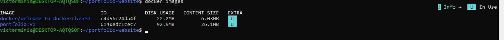
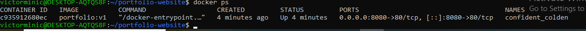
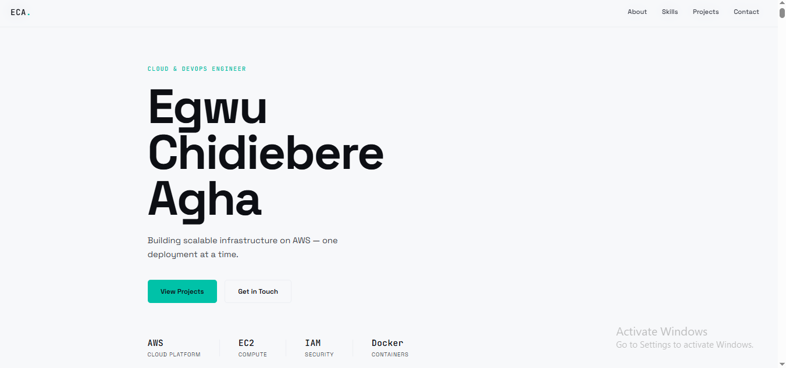

# 🐳 Containerised Portfolio Website

> **Assignment:** Containerize Your Portfolio Website Using Docker  
> **Author:** Egwu Chidiebere Agha  
> **Email:** vickilance50@gmail.com  
> **GitHub:** [github.com/minicvictor](https://github.com/minicvictor)  
> **LinkedIn:** [chidiebere-egwu](https://linkedin.com/in/chidiebere-egwu)

-----

## Table of Contents

1. [Project Overview](#1-project-overview)
1. [Repository Structure](#2-repository-structure)
1. [Dockerfile Explanation](#3-dockerfile-explanation)
1. [Build Instructions](#4-build-instructions)
1. [Run Instructions](#5-run-instructions)
1. [Verification](#6-verification)
1. [Challenges Encountered](#7-challenges-encountered)

-----

## 1. Project Overview

This project containerises a personal portfolio website using **Docker** and serves it through **Nginx**.

The portfolio showcases my AWS and DevOps skills — including EC2 deployments, IAM management, and Docker containerisation. It is a static site built with HTML and CSS, using the **Space Grotesk** and **JetBrains Mono** typefaces, and a teal (`#00C2A8`) accent colour scheme.

**Tech stack inside the container:**

|Layer            |Technology          |
|-----------------|--------------------|
|Container runtime|Docker              |
|Web server       |Nginx (Alpine)      |
|Website          |HTML5, CSS3         |
|Base OS          |Alpine Linux (~5 MB)|

**Why Docker?**  
Docker ensures the website runs identically on any machine — no “it works on my laptop” problems. The entire runtime environment is captured in a single `Dockerfile` and can be rebuilt in seconds.

-----

## 2. Repository Structure

```
portfolio-website/
├── index.html       # Main portfolio webpage
├── style.css        # Stylesheet (fonts, layout, colours)
├── Dockerfile       # Docker build instructions
└── README.md        # Project documentation (this file)
```

-----

## 3. Dockerfile Explanation

```dockerfile
FROM nginx:alpine
```

**Base image.** Pulls the official Nginx image built on Alpine Linux. Alpine is chosen because it is extremely lightweight (~5 MB compressed), reducing both image size and attack surface compared to a full Debian/Ubuntu base.

-----

```dockerfile
LABEL maintainer="Egwu Chidiebere Agha <vickilance50@gmail.com>"
LABEL description="Egwu's portfolio website — containerised with Docker and served by Nginx"
LABEL version="1.0"
```

**Metadata labels.** These key-value pairs attach searchable information to the image. They appear when you run `docker inspect` and are good practice for identifying image owners and versions.

-----

```dockerfile
RUN rm -rf /usr/share/nginx/html/*
```

**Clean default content.** The official `nginx:alpine` image ships with a default placeholder page. This `RUN` instruction deletes it so our own files are the only content Nginx serves.

-----

```dockerfile
COPY . /usr/share/nginx/html
```

**Copy website files.** Copies everything in the current build context (`.`) — the `index.html` and `style.css` files — into Nginx’s default web root directory inside the container.

-----

```dockerfile
EXPOSE 80
```

**Document the port.** Declares that the container listens on port 80 at runtime. This is documentation for developers and orchestration tools (like Docker Compose or Kubernetes); it does **not** publish the port to the host machine by itself.

-----

```dockerfile
CMD ["nginx", "-g", "daemon off;"]
```

**Start Nginx in the foreground.** Docker requires the primary process to stay in the foreground. The `daemon off;` directive prevents Nginx from forking into the background — which would cause the container to exit immediately since the foreground process would have ended.

-----

## 4. Build Instructions

Make sure Docker Desktop (or Docker Engine on Linux) is installed and running before proceeding.

### Clone the repository

```bash
git clone https://github.com/minicvictor/Dockerized/portfolio-website.git
cd portfolio-website
```

### Build the Docker image

```bash
docker build -t portfolio:v1 .
```

|Flag / argument  |Meaning                                                |
|-----------------|-------------------------------------------------------|
|`-t portfolio:v1`|Tags (names) the image as `portfolio` with version `v1`|
|`.`              |Sets the build context to the current directory        |

### Confirm the image was created

```bash
docker images
```

You should see `portfolio` listed with tag `v1`.

-----

## 5. Run Instructions

### Start the container

```bash
docker run -d -p 8080:80 --name portfolio-site portfolio:v1
```

|Flag / argument        |Meaning                                                            |
|-----------------------|-------------------------------------------------------------------|
|`-d`                   |Runs the container in detached (background) mode                   |
|`-p 8080:80`           |Maps port **8080** on your host to port **80** inside the container|
|`--name portfolio-site`|Gives the container a memorable name                               |
|`portfolio:v1`         |The image to run                                                   |

### Open the website

Navigate to the following URL in your browser:

```
http://localhost:8080
```

### Useful management commands

```bash
# Check running containers
docker ps

# View container logs
docker logs portfolio-site

# Stop the container
docker stop portfolio-site

# Remove the container
docker rm portfolio-site

# Remove the image
docker rmi portfolio:v1
```

-----

## 6. Verification

### 6.1 Docker image created successfully

> 📸 **Screenshot — `docker images` output showing `portfolio:v1`**

<!-- Replace this block with your actual screenshot -->

```
REPOSITORY   TAG       IMAGE ID       CREATED          SIZE
portfolio    v1        <image-id>     X minutes ago    XX MB
```



-----

### 6.2 Container running

> 📸 **Screenshot — `docker ps` output showing the running container**

<!-- Replace this block with your actual screenshot -->

```
CONTAINER ID   IMAGE          COMMAND                  CREATED         STATUS         PORTS                  NAMES
<id>           portfolio:v1   "/docker-entrypoint.…"   X minutes ago   Up X minutes   0.0.0.0:8080->80/tcp   portfolio-site
```



-----

### 6.3 Portfolio website in the browser

> 📸 **Screenshot — Portfolio website displayed at `http://localhost:8080`**



-----

## 7. Challenges Encountered

### Challenge 1 — Port already in use

**Problem:** Running `docker run -p 8080:80 ...` failed with the error:

```
Error: Bind for 0.0.0.0:8080 failed: port is already allocated
```

**Cause:** Another process (or a previously stopped-but-not-removed container) was already using port 8080.  
**Resolution:** Ran `docker ps -a` to list all containers (including stopped ones), removed the conflicting container with `docker rm <container-id>`, then re-ran the command. Alternatively, a different host port (e.g., `-p 9090:80`) can be used.

-----

### Challenge 2 — Cached build layers after file edits

**Problem:** After editing `style.css`, rebuilding the image appeared to complete instantly — but the browser still showed the old styles.  
**Cause:** Docker cached the `COPY` layer and did not detect the file change.  
**Resolution:** Used `--no-cache` to force a clean rebuild:

```bash
docker build --no-cache -t portfolio:v1 .
```

Also stopped and removed the old container before starting a fresh one.

-----

### Challenge 3 — Google Fonts not loading inside the container

**Problem:** The portfolio fonts (Space Grotesk, JetBrains Mono) did not load when the browser was offline.  
**Cause:** The fonts are loaded via `<link>` tags pointing to Google Fonts CDN — they require an active internet connection.  
**Resolution:** Confirmed the container itself does not need internet access; the **browser** fetching the page makes the request. Fonts loaded correctly once the machine was connected. For a fully offline solution, fonts can be downloaded and served as local files inside the container.

-----

*Built with Docker · Served by Nginx ·*

-----

## CI/CD Pipeline – Portfolio Auto-Deployment

This project uses GitHub Actions to automatically deploy my portfolio website
to an AWS EC2 instance on every push to the `main` branch.

The workflow is defined in `.github/workflows/deploy.yml` and is triggered by
a `push` event on the main branch. It uses the `appleboy/ssh-action` to
securely connect to the EC2 instance using an SSH private key stored as a
GitHub Secret. Once connected, it navigates to the web root, pulls the latest
code from the repository, and reloads Nginx to serve the updated content.

GitHub Secrets store sensitive values (EC2 host, username, and SSH private key)
so no credentials are hardcoded in the repository. I encountered a permissions
issue where the SSH user lacked sudo access to reload Nginx — I resolved this
by adding a custom sudoers rule via `/etc/sudoers.d/github-actions`.

The pipeline ensures zero-manual-deployment: any approved change merged to
main is live on the server within seconds.

-----


